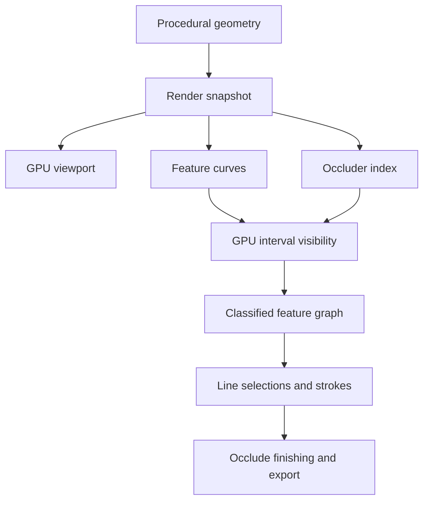

# Occlude 3D: procedural geometry and a WebGPU line-art renderer

Implementation handoff for Codex · 13 September 2026  
Repository: https://github.com/Kalmarv/occlude  
Latest source inspected for this handoff: `c705cdeb6a575eecc2759572e8d43dbb8e4316d2`  
Status: Implement the staged MVP in an isolated development fork/checkout.

## 1. Goal and motivation

Give Occlude a first-class procedural 3D workflow that produces plot-ready vector line art. Artists should be able to construct geometry, select its elements, attach attributes, apply repeated rules and forces, extrude surfaces, query nearby geometry, and render the result with expressive outlines, hatch, and contour lines.

The motivation is the creative workflow of Houdini and Blender Geometry Nodes, expressed through Occlude's existing code-and-data style. A catalog of 3D shapes projected into 2D is insufficient. The new geometry must remain inspectable and editable between operations, and the generated drawing curves must remain useful data.

Use Blender's **Grease Pencil Line Art modifier** as the reference for scene-to-line generation, **Freestyle** for feature selection and programmable stroke construction, and **Grease Pencil's geometry/modifier workflow** for making generated strokes editable data. These are complementary references; Freestyle and Grease Pencil Line Art are distinct systems. Krbn remains the aesthetic reference for surface hatch, contours, and hidden-line styling; ln remains a useful reference for simple scene and path concepts. Occlude owns its implementation, renderer, and export pipeline.

**WebGPU is a foundation, starting in the first working milestone.** This supersedes the earlier suggestion to build a CPU-only product and add GPU compute at the end. The first product release requires both a WebGPU viewport and meaningful GPU compute in final vector visibility, plus a small procedural GPU batch. A CPU reference is required for correctness and headless execution; it is not a reason to defer the GPU architecture.

The reference outcome is a seeded grid of extruded forms, selected and deformed procedurally, viewed through an editable camera, with creases, silhouettes, optional dashed hidden runs, and surface hatching. It must export through Occlude as actual vector strokes suitable for SVG and the existing plotter workflow.

## 2. Decisions already made with the user

Treat these as constraints, not questions to reopen during implementation.

| Decision | Consequence |
| --- | --- |
| Creative procedural construction is the main goal | Steps, selections, attributes, forces, growth/extrusion, and queries must participate in the MVP |
| We want our own renderer | No runtime dependency on Blender, ln, or Krbn to produce drawings |
| Blender Line Art and Freestyle are behavioral references | Separate feature extraction, visibility, line selection, artistic stroke construction, and physical plot planning |
| Generated lines participate in the procedural workflow | Source attributes survive rendering; line sets and strokes can be queried, grouped, filtered, and modified |
| GPU work starts early | Buffer layouts, asynchronous boundaries, worker ownership, and GPU verification arrive with the first vertical slice |
| Existing 2D geometry remains valuable | Reuse paper-space clipping, finishing, pen assignment, planning, SVG/G-code, and plotting where their semantics apply |
| Preserve pen-name drawing ergonomics | Keep existing `stroke: 'name'` and the checkout's existing fill/pen syntax; never introduce `{ pen: penObject }` as a replacement |
| Pens are complete definitions | Width, feed, lift/lower settings, delays, and optional color overrides belong to pen instances; no user-facing split into logical roles versus physical pens |
| Studio edits user libraries | Sketches can import `@user/pens` and `@user/papers`; one-off `pen()` and `paper()` values are equally valid |
| Color is an instance override | Twenty colors of one model do not require twenty library imports; preserve the color-picker workflow |
| Imperial paper is common | Preserve `inch()` and `mm()`, paper color, and sketch-level margins; paper units do not redefine world coordinates |
| Runs are isolated | No mutable ambient scene, camera, RNG, paper, pen, asset, or GPU-job state |
| Results capture their inputs | Library or camera edits must not change an already committed result/plot plan |
| Work must not affect production | Use a separate Git checkout/fork, dev container configuration, ports, image tags, and stores |

At the inspected revision, the first entry in `sketch.config.pens` is the default pen and the old top-level `config.pen` is removed. Preserve the current checkout's API rather than resurrect old example code from this conversation. Pure factories are module imports; operations that need seed, execution, paper, or resolved frames belong on the bound toolkit. Follow `CLAUDE.md` and applicable `AGENTS.md` when present.

## 3. Scope and stopping point

### Required MVP

- Polygon surface geometry, 3D point/curve geometry, transforms, adjacency, and attributes.
- Orthographic and perspective cameras, with explicit near/far clipping and camera-to-paper mapping.
- Face selection and one deliberately bounded face-extrusion operation.
- Frozen-state procedural passes, CPU callbacks, and at least one GPU batch combining displacement/field evaluation with an adjacency-based force or smoothing pass.
- Batched segment/ray queries against surfaces, sharing acceleration data with visibility where appropriate.
- WebGPU surface/line viewport and feature classification.
- GPU geometric line visibility, compared against a CPU reference.
- Visible and hidden runs; boundaries, polygonal silhouettes, creases, and marked edges.
- A shared classified feature set, attribute-based line selection, deterministic chaining/splitting, and independently reusable stroke styles.
- Planar surface hatch/crosshatch and mesh-plane section contours.
- Named pen styling, ordinary Occlude paper-space output, SVG and G-code export through the existing pipeline.
- At least one compound procedural example and a browser demo using the real GPU path.

### After the MVP

Connected-region extrusion, bevels, subdivision, robust mesh Booleans, sophisticated instancing, mesh import, smooth-surface silhouettes, principal-curvature hatch, suggestive contours, ridges/valleys, intersection-curve drawing, external-contour classification, multi-level occlusion, material masks, cast-shadow/light-contour lines, brush-texture simulation, and animation baking are later work. Preserve extension points without implementing empty frameworks for all of them.

OBJ/STL import is not the first milestone: procedural construction is the priority. A sphere may be a documented mesh approximation initially. Exact conic/quartic machinery is not required. Do not claim a perspective-projected circle can be represented exactly by an ordinary polynomial cubic; analytic conics need a suitable representation or bounded approximation.

No full Blender replacement, visual node editor, raster-to-vector tracing, ray-sample-only final visibility, or centroid-sorted object silhouettes as the general 3D solver.

## 4. Blender as a reference

### Which system informs which contract

| Blender system | What to adopt | What this means for Occlude |
| --- | --- | --- |
| Grease Pencil Line Art | Geometry-derived features, visibility, source/occluder controls, attribute transfer, baked strokes | Own the scene-to-curve renderer and preserve source identity |
| Freestyle View Map and Line Sets | One classified feature dataset with multiple selections | Make rendering results queryable and reuse visibility across styles |
| Freestyle stroke construction | Select, chain, split, filter, and style lines | Give artistic stroke construction an explicit data stage |
| Grease Pencil geometry and modifiers | Points/curves with attributes and ordered, selective modifications | Generated lines remain usable procedural geometry |
| Freestyle/Grease Pencil textures and visual effects | Expressive digital appearance | Translate chosen effects into actual vector marks where plot output is required |

Freestyle's documented scripting pipeline exposes selection, chaining, splitting, sorting, and stroke creation. This is the closest reference to the requested code-driven creative workflow. Use Occlude's explicit values, bound execution, and selection conventions to express it; do not reproduce Freestyle's implicit active operator set. [Freestyle scripting pipeline](https://docs.blender.org/manual/en/latest/render/freestyle/python.html)

### Line Art behavior

The manual describes feature categories including contours, creases, material boundaries, marked edges, and face intersections. It exposes selection by occlusion level, with zero meaning visible, and chaining controls. Those behaviors are our reference, not a promise of complete parity. [Blender Line Art manual, accessible versioned reference](https://docs.blender.org/manual/en/3.0/grease_pencil/modifiers/generate/lineart.html)

Blender's architecture documentation separates its CPU intersection/occlusion engine from line chaining. Therefore, do not assume Blender Line Art itself is a WebGPU or depth-buffer-only algorithm. Our GPU execution strategy is an Occlude design decision. [Blender code structure](https://developer.blender.org/docs/features/grease_pencil/line_art/code_structure/)

| Reference behavior | Occlude treatment |
| --- | --- |
| Choose scene/object/collection as line sources | Separate geometry contributing lines from geometry acting as an occluder |
| View contours and creases | Required; define crease angle and facing conventions precisely |
| Marked edges | Required explicit edge attribute |
| Material boundaries | Later; use face attribute discontinuities without importing Blender's material model |
| Intersection curves | Later generator; intersecting objects must nevertheless occlude correctly in the MVP |
| Occlusion-level selection | MVP has visible/hidden; preserve interval data for future level counts |
| Chaining | Construct artistic strokes; preserve deliberate breaks through later plot planning |
| Bake/edit strokes | Committed projected curves are inspectable output data |

Keep total visibility computation independent of the number of style layers: extract/classify once, then select and style the cached result. An object excluded from line generation may still occlude lines from other objects.

### Freestyle selections and stroke styles

Freestyle separates edge selection from the appearance assigned to selected edges. Visibility, feature category, marks, and collection membership are selection inputs. Its stroke controls then change how selected pieces become finished strokes. Adopt this separation, with Occlude attributes replacing hard-coded Blender collection/material identifiers where appropriate. [Line Sets](https://docs.blender.org/manual/en/latest/render/freestyle/view_layer/line_set.html), [stroke controls](https://docs.blender.org/manual/en/latest/render/freestyle/view_layer/line_style/strokes.html)

Required selection contract: include/exclude feature flags, visible/hidden status, source object/group, and user attributes, using explicitly combined predicates. Use the checkout's `.filter()`/selection idioms instead of creating a second unrelated query language. A marked edge remains subject to visibility unless the line set explicitly requests hidden output. A filter that removes an object's lines must not remove its surfaces from occlusion.

Keep these meanings separate: a topological boundary is an open mesh edge; a silhouette is a facing transition; a section is a surface/plane intersection; a hatch is generated surface decoration. Freestyle also distinguishes per-object contours from external contours against the background. Background-side classification requires additional information; do not expose an `externalContour` checkbox that merely aliases silhouettes. Curvature features and quantitative occlusion ranges remain later generators/classifiers.

Required stroke controls: plain chaining or no chaining, same-object/source continuity, splitting at a paper-space turning-angle threshold, length-based selection, named pen assignment, physical dashes, and seeded wobble. Keep sketchy repeated passes, recursive splitting, importance/density-driven abstraction, and the full Freestyle modifier catalog as extensions. The MVP should prove the contracts with existing Occlude modifiers before adding many new ones.

### Modifiers, textures, and physical output

Freestyle geometry modifiers operate on resulting 2D strokes in stack order. Grease Pencil also supports modifiers acting on its point/curve geometry and attributes. This leads to three explicit operation domains in Occlude: model geometry, surface-attached curves before visibility, and paper strokes after visibility. A modifier's name alone must never decide which domain it changes. [Freestyle geometry](https://docs.blender.org/manual/en/latest/render/freestyle/view_layer/line_style/geometry.html), [Grease Pencil modifiers](https://docs.blender.org/manual/en/latest/grease_pencil/modifiers/introduction.html)

| Reference capability | Occlude integration |
| --- | --- |
| Noise, smoothing, offsets, simplification, curve fitting | Reuse suitable kernels; preserve stage, coordinate-space, and approximation contracts |
| Along-stroke, tangent, distance, crease-angle, and source-attribute influences | Expose typed stroke/point attributes and field inputs, then map them to supported styles |
| Stroke extension, tip trimming, repeated strokes | Later curve operations with stable parentage and explicit endpoint rules |
| Weight/proximity filters and surface wrapping | Reuse 3D selections and batched queries; keep attachments to source surfaces |
| Stroke/fill holdouts and layer masks | Reuse Occlude masks/clips for defined paper-space composition |
| Variable thickness, gradients, alpha, brush textures | Require a supported pen mapping or an explicit conversion to vector mark geometry for plotting |
| Blur, glow, pixelation, image-space effects | Optional digital preview effects; outside the plot-ready MVP |

Freestyle brush textures use coordinates along generated strokes, including optional tip treatment. Preserve an along-stroke coordinate and endpoint identity now. Later texture-to-mark generators can use them for interrupted ink, stipple, or multiple fine lines. A texture image in a GPU shader is not itself an SVG centerline or a plotter toolpath. [Freestyle texture coordinates](https://docs.blender.org/manual/en/latest/render/freestyle/view_layer/line_style/texture.html)

Grease Pencil separates layer ordering from depth ordering. Occlude should likewise keep paper composition order separate from scene visibility. Its image effects are distinct from geometry modifiers; do not let a viewport-only effect silently change committed plot geometry. [Stroke depth order](https://docs.blender.org/manual/en/latest/grease_pencil/properties/strokes.html), [visual effects](https://docs.blender.org/manual/en/latest/grease_pencil/visual_effects/introduction.html)

Use millimeters for drawn dash lengths, spacing, offsets, and error bounds, with `inch()` conversion where appropriate. Blender's pixel-based line-style defaults are reference settings to translate, not Occlude's export units. Nib footprint still determines physical caps and width. A digital square cap or continuous alpha ramp is not a new machine capability. [Freestyle style units](https://docs.blender.org/manual/en/latest/render/freestyle/view_layer/line_style/index.html)

Pin an installed Blender version and configuration when creating comparison fixtures. Its manual's `latest` pages move; the legacy manual above establishes concepts, not current exhaustive behavior. Use tiny scenes rendered in that pinned version for visual reference, and independent geometric expectations for correctness tests. Do not require Blender in normal application builds.

Implement independently from documented behavior and geometry. Do not transplant Blender implementation code or assume license compatibility; retain Occlude's existing license and record third-party provenance. Hatching is our separate feature-generator project, not a feature to assume Line Art supplies automatically.

## 5. Development isolation: do this before building

1. Inspect the actual checkout, current branch, repository instructions, Docker configuration, and working tree. Record the starting commit. Reconcile newer fixes before work.
2. Create a separate checkout of the fork/work branch, suggested branch `feat/3d-webgpu`. A local forked checkout suffices if no remote fork exists. Do not create or push an external fork unless the implementation session authorizes that action.
3. Preserve all unrelated changes and production working trees. Implement and commit locally; do not merge, deploy, restart production, or connect to a physical plotter as part of this task.
4. Use a task-specific Compose project and override file, suggested `compose.3d.yml`, and launch only `dev`.
5. Override the dev image name: the inspected Compose file uses `occlude-dev:latest`. A different Compose project alone does not isolate that tag.
6. Choose an unused dev port. The inspected services use `network_mode: host`; project names do not isolate ports under host networking. Preserve the production listener.
7. Resolve every volume path. The dev service mounts `packages/occlude-studio/dev-store/{sketches,fills,assets,results}`; use directories under the isolated checkout or other task-owned storage. Do not mount production libraries writable. Use starter presets or explicit copies of permitted fixtures.
8. Inspect the fully merged Compose configuration before launch. Do not run blanket `docker compose up`/`pnpm docker:up`, global pruning, or `down -v` against shared projects.

Example command shape, after choosing and verifying the override:

```sh
docker compose -p occlude-3d -f docker-compose.yml -f compose.3d.yml --profile dev config
docker compose -p occlude-3d -f docker-compose.yml -f compose.3d.yml --profile dev build dev
docker compose -p occlude-3d -f docker-compose.yml -f compose.3d.yml --profile dev up -d dev
```

The override must supply unique image/port/store settings; the commands alone do not establish isolation. Build Rust/WASM and dependency changes into the dev image: existing mounts cover selected sources, not every generated artifact. Rebuild when a manifest, WASM ABI, shader asset packaging, or tooling change requires it.

The server can run in Docker while WebGPU runs in the user's host browser. That browser needs an available adapter and a secure context: localhost or properly configured HTTPS. An arbitrary HTTP LAN address is not sufficient. A headless browser inside Docker is a separate GPU-access configuration. Detect and report hardware versus software adapter execution; do not count a software renderer as GPU-performance validation. [WebGPU environment and worker API](https://developer.mozilla.org/en-US/docs/Web/API/WebGPU_API)

## 6. Architecture and ownership

Use four distinct data layers:

1. **Procedural geometry:** editable world-space points, curves, surfaces, attributes, and instances.
2. **Render snapshot:** triangles, source topology, stable feature IDs, candidate curves, camera, and spatial acceleration.
3. **Line drawing data:** a classified feature graph, selections, and constructed strokes that remain inspectable and editable.
4. **Committed output:** resolved paper-space ink, then the existing Occlude finishing/plan/export outputs, with captured inputs.



### Host resources versus execution data

The Studio host owns a persistent GPU device/context and reusable pipeline resources. Pass access explicitly to each run/session. Each execution owns its geometry snapshots, RNG, camera request, job IDs, buffers/leases, and results. A host device is not an ambient current scene.

One device-owning worker should perform compute and viewport drawing where possible, using a separate OffscreenCanvas for the 3D viewport. Transfer the canvas once; never assume GPU buffers can be structured-cloned to another worker/device. Keep the existing 2D paper preview available. If a different worker split is necessary, document the concrete transfer and scheduling costs.

Separate geometry revision, camera revision, style revision, and committed-result identity. Camera movement must not rerun procedural generation or consume new random draws. Style changes should reuse visibility when they do not change candidate geometry or required tolerances.

Cache dependency rules must be observable in tests and profiling:

| Change | Recompute |
| --- | --- |
| Model topology or positions | Affected topology, features, spatial data, and visibility |
| Camera | Projection, view-dependent features, visibility, and dependent paper styling |
| Source/occluder membership | Affected candidates or visibility; never treat this as a color-only edit |
| Add a hatch family or another feature generator | New candidate geometry and its visibility; reuse unchanged scene data |
| Filter, pen color, dash, or paper-space wobble | Selection/stroke construction/styling and downstream output; reuse valid visibility |
| Pen width or paper size | Re-evaluate physical tolerances, framing, and paper-space generators; refine/recompute if the old result is insufficient |

A reusable style is a pure value. Its construction must not capture an ambient camera, active material, or current GPU device. A custom predicate or field reads the explicit execution/snapshot supplied to it. Cache entries are owned by a render session and keyed by content/revision contracts, not a single global last View Map.

GPU-owned geometry needs explicit ownership and versioning. Existing public material arrays can be modified; identity-only caching of externally mutable buffers is unsafe. Use snapshots at upload boundaries. Readback creates an owned CPU result, not an alias to a mapped buffer.

## 7. Geometry and coordinate contracts

### Coordinates

- Right-handed world space, Z up, explicit object transforms.
- World coordinates are scene units, not percentages of the paper. Initially an explicit camera span/FOV controls apparent size; no implicit physical scale links world units and paper mm.
- If physical model dimensions are supported later, require an explicit model-unit scale; do not reinterpret `mm()` contextually in undocumented ways.
- Camera looks toward negative camera Z. Near/far are positive distances. WebGPU clip depth is 0–1. Derive and test the projection matrices; do not reuse OpenGL depth conventions accidentally.
- Camera viewport defaults to the execution's drawable paper frame. Preserve margins, existing paper origin/y-direction behavior, and the current 2D coordinate API.
- Orthographic vertical span and perspective vertical FOV have explicit units. Fixed framing is the default; fit-to-geometry is an explicit operation that can be captured.

### Surface representation

Suggested internal layout: coordinate columns, polygon face offsets/vertex indices, derived edges/adjacency, and attribute columns by domain. Triangulate for rendering and spatial queries while preserving `triangle → face`, `edge → source edge`, and object/instance mappings.

Keep modeling polygons distinct from derived triangles. A triangulation diagonal must not become a crease, material border, hatch seam, or authored edge merely because it exists in the GPU buffer. If deformation makes the represented surface nonplanar, a derived diagonal can be a genuine facing transition of that piecewise surface; classify that silhouette with source provenance instead of suppressing it blindly.

Support simple planar polygon faces initially, with deterministic triangulation. Reject unsupported holes, degenerate faces, and ambiguous non-manifold topology clearly. Deformation can create nonplanar faces: define their piecewise triangular surface and retain source-face identity; do not continue using a fictitious single plane. Recompute geometric normals after deformation. Normal transforms use the inverse transpose and mirrored transforms require consistent winding treatment.

### Attributes and identity

Point, edge, and face domains are required; face-corner attributes are reserved for later UV/seam work. Selection predicates read resolved attributes and derived quantities. Preserve stable semantic IDs across unchanged elements; assign new IDs deterministically from source operation/parent/local ordinal. Storage indices are not persistent IDs.

Document inheritance for each topology edit, including the distinction between copied values and distributed extensive quantities. Preserve parentage for generated cap/side faces and new edges. State-bound references from previous passes must fail clearly when reused incorrectly.

Do not generalize every 2D kernel to arbitrary dimensions. Share dimension-independent attribute/edit infrastructure where useful and keep 2D planar Booleans as 2D operations. Avoid a generic numeric backend framework before there are concrete consumers.

## 8. Procedural MVP

### Required construction and editing

- Surface grid, box, arbitrary polygon mesh, point cloud, and open 3D polyline.
- Translation, rotation, and scale of geometry/instances.
- Face selection by normal direction, area, attribute predicate, and adjacency; point/edge selections by attributes and spatial criteria.
- Frozen-input `.steps()`-style passes, ordered commits, deterministic iteration count, optional bounded history.
- One independent-face extrusion operation, explicitly named/documented to distinguish it from connected-region extrusion and graph-tip growth.
- At least one field-driven displacement and adjacency-based relaxation/tension batch.
- Batched segment/ray intersection against a surface and nearest-surface query for selected points.

### Extrusion semantics

Define cap replacement, side-face winding, original boundary retention, shared-vertex handling, distance sign, zero-distance behavior, and attribute transfer before implementation. For an open height grid, replace the selected face with its translated cap and connect its perimeter with side faces; shared input topology must not be moved accidentally. Adjacent independent extrusions may produce coincident side geometry: canonicalize duplicates for rendering or limit the MVP demo's selections accordingly and document the boundary. Do not silently delete arbitrary coincident surfaces.

### CPU/GPU cooperation

CPU executes arbitrary JS callbacks and topology changes. GPU executes declared built-in batches over fixed topology: upload once, alternate buffers across passes, then read back at an explicit CPU boundary. Implement a gather-per-vertex adjacency pass initially to avoid scatter float-atomic assumptions. Neighborhood forces use spatial bins/CSR-style lists with defined exclusions and deterministic ordering.

Do not dispatch one GPU call per scalar force or query. Batch queries over one prepared geometry state. Small batches may use the CPU based on measured overhead. Unsupported GPU operations must be rejected or explicitly materialized to CPU at a known boundary; no hidden readback inside a synchronous callback.

Ordinary JS fields remain supported. Known built-ins may carry GPU descriptors while remaining callable on CPU. Custom closures can be sampled on CPU and uploaded where meaningful. Do not attempt automatic compilation of arbitrary JS into WGSL. Stable seeds for GPU-generated choices should derive from execution seed, operation ID, element ID, and iteration, never workgroup scheduling.

## 9. Execution/API integration

Preserve the current synchronous 2D entry points. Add explicitly asynchronous entry points for GPU work, suggested `sketchAsync`, `compileSketchAsync`, and `renderAsync`; choose exact names consistently with the checkout. Do not return a Promise from an existing synchronous function without changing its contract.

For 3D rendering alone, a synchronous sketch may return a deferred line-art scene value that an async renderer resolves. The synchronous renderer must either use its documented CPU path or report that async rendering is required. GPU procedural batches use the async sketch path so later CPU operations can explicitly await materialization.

Proposed workflow semantics, not a frozen list of new method names:

```text
sketch configuration: imported or one-off paper; pens named outline/hatch/hidden
create a surface grid
select faces with a seeded field
extrude selected faces in a frozen pass
await GPU displacement + adjacency relaxation over many iterations
batch-query a second surface to constrain selected vertices
create line-art scene with camera, feature filters, hatch, and named stroke styles
return scene beside ordinary 2D marks/labels
renderAsync resolves geometry and commits one plot-ready result
```

Existing configuration syntax remains valid, for example:

```ts
import { paper, pen, inch, mm } from 'occlude';
import { fineliner } from '@user/pens'; // illustrative library name

const config = {
  paper: paper({ width: inch(8.5), height: inch(11), color: '#F5F0E6' }),
  margin: inch(0.5),
  seed: 42,
  pens: {
    outline: fineliner({ color: '#18202A' }),
    hatch: pen({ width: mm(0.25), color: '#647184' }),
    hidden: fineliner({ color: '#A0A0A0' }),
  },
};
// Existing 2D drawing remains { stroke: 'outline' }, etc.
// The new line-art style uses the same name resolver, never pen objects.
```

Avoid mixing a surface's shading attributes with Occlude's `Material` class terminology. Do not repurpose existing 2D `fill()` semantics for a surface hatch without a clear adapter. A surface hatch generator returns curves; their pen style is resolved through the existing drawing vocabulary.

### Async lifecycle

Every submitted job captures immutable input revisions. Coalesce camera changes, discard stale completions, and serialize mutation of retained worker state. Cancellation stops submitting subsequent batches and prevents adoption; already submitted GPU commands may finish. Release buffers only when safe, including after device loss. Readback uses staging buffers and asynchronous mapping; do not block the UI waiting for a GPU result. [GPU readback contract](https://developer.mozilla.org/en-US/docs/Web/API/GPUBuffer/mapAsync)

The camera used for a committed export must be explicit. Orbiting is a preview operation; committing the view must write or capture camera values in sketch/project configuration. Camera interaction must not silently change a saved drawing or an active plot. Final SVG, G-code, timing, and serial plotting use one committed result and its captured pen settings.

## 10. Renderer stages and feature contract

### Render snapshot

Pack world/camera-relative positions, triangles, topology mappings, face normals, object IDs, source edge IDs, and feature flags. Use camera-relative or locally normalized f32 coordinates on GPU; retain f64 source geometry for CPU refinement and reconstruction. Reuse snapshots across camera/style changes where possible.

Derive render triangles only after procedural edits have committed. For transformed normals and negative scale, test facing consistency explicitly. A two-sided surface occludes by default regardless of whether it contributes front-facing lines. Do not discard all back-facing occluder triangles: open surfaces, interiors, and interpenetration need a defined two-sided rule.

### Candidate curves

Each curve/segment record needs source object/instance, source element ID, feature kind, support triangle/face information, original parameter range, stable chain/order key, and relevant interpolated attributes. These are numerical buffers for GPU use and ordinary inspectable data on CPU.

Required generators:

- **Boundary:** an original edge with one incident face.
- **Crease:** an original edge whose incident geometric normals exceed a documented dihedral threshold. Do not infer creases from vertex normals alone.
- **Silhouette:** an edge separating front- and back-facing incident surface triangles/faces. Suppress artificial diagonals within a planar face, while retaining real facing transitions of a deformed piecewise surface. MVP silhouettes are polygonal; view-dependent smooth contours inside faces are later work.
- **Marked:** an explicit user edge attribute, regardless of crease status.
- **Hatch and section curves:** described below.
- **User curves:** open 3D paths can be visible/occluded without being closed surfaces.

An edge can have several feature flags but should not be drawn repeatedly by default. Define style precedence or explicit multi-style selection. Preserve attributes through interval splitting and keep line-source selection independent from the occluder set.

### Classified feature graph and line sets

Return an immutable, revision-bound feature dataset after visibility. Retain source topology, feature flags, support/depth data, visible/hidden intervals, junction provenance, and original parameter ranges. This is the Occlude equivalent of the useful part of Freestyle's View Map. It must be usable without the Studio UI.

A line set is a selection over this dataset plus a stroke-construction/style recipe. Reuse selection/filter/group/reduction conventions from `relation.ts`; do not make it a mutable global operator context. Selection predicates must be able to read feature kind, visibility, source IDs/groups, crease angle, and transferred user attributes. Define domains: discrete object/face labels are not numerically interpolated; scalar point attributes may be interpolated; an edge with two incident faces needs explicit any/both/side selection semantics.

Default overlap behavior: within a line set, a feature matching multiple flags is emitted once. Across line sets, use explicit stable priority to assign each source interval once unless overdraw is requested. If sets select partly overlapping ranges, resolve ownership by interval, not by discarding a whole source edge. A future sketchy style may deliberately generate multiple strokes; these are authored marks, not duplicate feature detection.

Cache visibility for the union of requested candidate generators. Adding a previously absent generator requires classifying its new curves. Changing a downstream selector over already classified data does not. Changing a crease threshold can be a filter if all necessary edges/angles are cached; otherwise it invalidates candidate extraction.

### Artistic stroke construction

The required order is: select classified runs → chain compatible runs → split/filter chains → apply ordered stroke modifiers → emit paper curves. Preserve the option to sort by an artistic priority before density-based selection in later work. This sort is not a substitute for 3D visibility and is not the machine's pen-travel order.

Join only compatible segments: same pen/style assignment, visibility category, allowed feature types, source continuity, and endpoint tolerance. By default stop at ambiguous branching junctions; a screen-space crossing is not a topological connection. Provide deterministic tie-breaking for any optional continuation rule. Closed loops need a deterministic start and orientation.

Never bridge a hidden interval merely because its endpoints are close. Split at required sharp corners and apply minimum-length filtering to the constructed chain rather than each tessellation segment. Record why a break exists: occlusion, clipping, dash, source/style boundary, or deliberate artistic split. Repeated passes and random offsets need seeds derived from stable source/style/pass identities, not the order of selected array rows.

Maintain original source parameters and a defined cumulative paper arclength. Dash/noise phase must not restart accidentally at visibility cuts or triangulation boundaries. Keep a stable anchor on the unclipped source chain where possible. Camera changes can legitimately change projected lengths and silhouette topology; promise determinism for identical snapshots, not impossible phase identity across all views. A later texture needs the same along-stroke coordinate plus optional across-stroke/tip coordinates.

### Stroke data and procedural editing

Constructed strokes are first-class values, not only SVG strings or private GPU draw calls. Suggested compact storage: point/primitive buffers, stroke offsets, style/pen IDs, source interval mappings, bounds, arclength data, and attribute columns. Preserve native 2D lines/arcs/cubics when an operation permits them; resample only at a declared approximation boundary. Camera-depth and source position can remain attached metadata after projection.

Support filtering/grouping strokes and reading their points, length, feature/source attributes, and visibility category. Source selections should therefore influence both modeling and drawing: e.g. an extruded cap's `importance` can control whether its creases are retained, and its `hatchDensity` can drive generated hatch. A later committed stroke edit creates a new value tied to the originating snapshot; it must not silently resolve against a newer mesh.

Do not call this full Grease Pencil editing parity. MVP requires code-level inspection/selection and existing applicable modifiers, plus source-linked picking in Studio. Freehand drawing tools, animation layers, and a modifier/node editor are future products.

### Modifier domains and pen semantics

| Domain | Examples | Visibility consequence |
| --- | --- | --- |
| Model geometry | Extrusion, forces, surface deformation | Rebuild affected render geometry and visibility |
| Surface-attached curves | Hatch tracing, wrapped decorative lines | Keep support mapping valid; classify changed curves |
| Paper strokes | Dash, wobble, length filtering, deliberate stylized overshoot | Operate on classified output; retain ordinary 2D clipping/finishing |

Paper-space wobble may deliberately move visible ink beyond its original projected surface. That is a drawing effect. A request to keep modified ink attached to a surface requires lifting/projecting it onto a valid support and reclassifying; stale depth data must not be treated as valid for displaced geometry. Existing 2D `smooth`/`roughen` pre-occlusion semantics remain unchanged when invoked in the normal 2D pipeline.

Use named pens for silhouettes, creases, hatch, and optional hidden runs. Preserve `stroke: 'name'` and current fill syntax. Physical nib width determines plotted width; ghosting can use another pen or physical dash gaps. A scalar appearance field can drive explicit pen selection or mark density, but must not silently become continuous pressure, color mixing, or alpha commands on a fixed-pen plotter. Keep pen feed/lift/delay settings in the captured pen definition.

Regular per-point modifier batches may later share the WebGPU infrastructure. Initial graph chaining and arbitrary JS predicates may run on CPU after a batched readback. Do not add one GPU dispatch or readback per line set, point, or callback, and do not postpone meaningful GPU visibility until the styling system is complete.

## 11. WebGPU visibility: initial algorithm

Use GPU geometric interval classification for final vector visibility. The following method is the recommended initial implementation, independent of Blender's implementation. An alternative is acceptable only if it satisfies the same data, precision, and completeness contracts and its tradeoff is documented.

### A. Clip before projection

Clip triangles and feature segments against near/far planes before perspective division, preserving interpolation weights, source identity, and original segment parameters. Triangles clipped into polygons may be triangulated for the visibility kernel with their original surface provenance retained. Do not invent visible cut edges unless the user requests clipping-boundary drawing.

Validate eye/target/up, finite coordinates, positive orthographic span, FOV range, and near < far. Explicitly handle an eye on a surface and degenerate clipped geometry. These cases must produce a documented result or diagnostic rather than NaNs.

### B. Conservative candidate generation

Build a broad-phase index over projected triangle bounds and query it for each projected segment. A tiled screen-space index or BVH is suitable. Initial index construction may run on CPU; bulk pair classification must run on GPU in the shipped GPU path.

The index must be conservative. Expand bounds for numeric uncertainty and route uncertain clipping/projection cases through a safe fallback. CPU refinement of returned pairs cannot recover a triangle that was wrongly omitted by the broad phase. Test candidate completeness against an all-pairs CPU oracle on small/adversarial scenes.

Do not allocate all segment × triangle pairs for general scenes. Batch candidates, set explicit capacity limits, and detect output overflow. A capacity overflow must trigger a bounded retry, CPU fallback, or actionable error; never silently drop potential occluders.

### C. Pairwise hidden intervals

For a triangle and a segment, visibility is determined by whether the ray from the camera to each point of the segment crosses the triangle first.

For perspective, form the triangle's occlusion volume from the three side planes through the camera and triangle edges, plus the triangle plane oriented to include the side away from the camera. For orthographic projection, use the corresponding prism extruded along the viewing direction and the behind-triangle half-space. This construction assumes near-clipped, finite, nondegenerate geometry; make plane orientation tests explicit.

Intersect the feature segment `P(t) = A + t(B - A)` with those half-spaces. Each linear inequality restricts `t`; their intersection yields an empty or contiguous hidden interval for that segment/triangle pair. Clamp to the segment's already clipped range. This produces original-segment parameters without ray-sample granularity or global painter ordering.

Preserve perspective correctness: projected screen interpolation and world-segment interpolation are not interchangeable. Reconstruct interval endpoints from the original parameter and project them, or carry the correct rational relationship. Add a strongly foreshortened fixture.

Self-occlusion uses support provenance and geometric depth, not an object-wide exclusion. A stroke on a surface should not be hidden by numerical noise from that same support; other parts of the same object must still hide it. Coplanar distinct geometry, coincident edges, shared triangle boundaries, and T-junctions need deterministic rules. Do not hide these decisions behind a universal depth bias.

### D. Compact and merge

Use count → prefix scan → scatter, or a similarly bounded scheme, to produce records keyed by source segment and occluder. Initial CPU stable sorting/interval union is acceptable after one batched readback; the GPU still performs the geometric bulk work. Profile before moving interval reduction to GPU.

Union the hidden intervals per segment and take their complement for visible intervals. Retain hidden runs for styling. Deterministic endpoint ordering must not depend on atomic append order. Suppress double classification along a triangulated polygon's internal boundaries.

MVP does not expose occlusion depth counts. Future levels require grouping/deduplicating triangle contributions into defined surface crossings; counting triangles blindly is incorrect. Intersecting objects should work now because occlusion is resolved per segment/triangle, without a global depth sort.

### E. Refine numerical uncertainty

Return an uncertainty flag when plane tests or endpoint divisions are poorly conditioned, near coplanar, or within the documented rounding envelope. Recompute ambiguous pairs from f64 source geometry on CPU with robust predicates where needed. Batch this work and report its frequency.

An epsilon chosen only by visual trial is not a proof of safety. Document the uncertainty rule, compare to independent cases, and use whole-query CPU fallback when candidate completeness is uncertain. The CPU reference must be usable without a GPU and should not merely repeat the same WGSL code through a translation layer.

### F. Project and hand off

Project the final intervals, chain/style them, and lower to Occlude-compatible geometry. GPU final visibility is geometric; it does not depend on the viewport's raster resolution. Existing input snapping and finishing rules still apply once the geometry reaches the 2D pipeline.

## 12. Viewport and GPU infrastructure

The first milestone must include actual GPU buffers, compute dispatch, asynchronous readback, and a triangle/depth viewport. A rotating cube produced only by a vertex shader is not sufficient evidence that the planned compute architecture works.

Viewport render passes may use depth, normals, object/face IDs, and feature overlays. Restrict initial attachments to those with real consumers. IDs support picking/inspection; a GPU ID result must map back to source topology, not a transient triangulation index.

During camera drag, show a fast depth-tested preview. On settle or explicit render, publish the final classified vector drawing. Clearly distinguish a pending/approximate preview from the committed output; the export path must not silently consume an approximate drag frame. Draw thick screen strokes using triangles/quads or another suitable stroke technique rather than assuming portable wide native lines.

GPU backend requirements:

- Lazy creation, feature/limit detection, reusable pipelines, reusable buffers, explicit ownership, and a memory budget.
- No GPU initialization on ordinary CPU/headless import.
- Chunk work to device limits and keep intermediate data resident across stages and procedural iterations.
- Use asynchronous readback and a bounded staging-buffer pool.
- Device loss invalidates resident caches and fails or falls back cleanly; application state and saved results survive.
- Stable IDs and fixed reduction order where determinism requires them; no assumption of portable float atomic addition.
- GPU timing when supported, plus wall time including compilation, upload, dispatch, refinement, readback, and CPU finishing.

WGSL's normal runtime floating-point path is f32, with optional f16, and implementations may reassociate/fuse operations. Do not promise CPU byte identity or cross-device numerical identity without evidence. [WGSL numerical rules](https://www.w3.org/TR/WGSL/#floating-point-evaluation)

For procedural GPU output, persist the realized geometry needed to reproduce the committed drawing. Re-exporting must not rerun a chaotic simulation with a different backend. Define repeatability by engine/backend/seed/input snapshot; keep the existing 2D determinism contract unchanged.

## 13. Hatch and contour generation

### Planar hatch: required

Generate lines in a stable face-local basis, clip against the modeled face, retain support provenance, and use exactly the same visibility path as feature edges. Crosshatch is a second direction set. Share coordinates across a triangulated face so the triangulation does not make seams or restart phase.

Hatch generation and stroke styling are separate: generating additional hatch changes candidate geometry, whereas changing its pen or applying a dash does not. Carry selected face attributes into hatch records. MVP must demonstrate one source attribute controlling hatch spacing/direction or line retention, with its evaluation domain documented. Begin with a per-face parameter if spatially varying surface density would expand the scope excessively.

The public drawing intent is physical spacing, e.g. `mm(1)`. MVP can implement this by laying a paper-space hatch family over each projected planar region, lifting its clipped segments onto the face, and then classifying them in 3D. This gives defined paper spacing. Document that it is view-dependent.

Alternatively, a face-local family may follow a projected surface direction with adaptive placement to a stated paper-spacing tolerance. Simply interpreting millimeters as world units is not acceptable. Later, a separate world/surface-spacing option can define physical texture that foreshortens naturally.

Nonplanar deformed polygons need piecewise surface support. Do not project a planar hatch onto an arbitrary folded face and claim it lies on the surface. For the MVP, restrict planar hatch to still-planar faces, or use a documented per-triangle interpolation scheme preserving source-face phase. Include an explicit fixture and demo showing the chosen behavior.

### Section contours: required

Intersect the surface with one or several user-defined planes; retain source provenance, connect compatible pieces, and pass the curves through ordinary visibility. These are model sections, distinct from silhouettes and 2D inset contour fills.

### Curved-surface hatch: next stage

Tangent fields, surface traversal, stable seeding, spacing control, curvature singularities, seam handling, and deformation attachment require a dedicated generator. Planar hatch is the first visible style milestone, not completion of Krbn-like curved hatch. Preserve barycentric/support mappings so later traces can follow deformation.

The current native `fill('contour')` uses analytic distance contours and certification in the Rust core. Reuse it for explicit 2D projected-region effects when desired; do not replace it with GPU distance textures as part of this project.

Neither importing Freestyle's style categories nor reproducing Grease Pencil's textured materials supplies curvature-following hatch automatically. Keep Krbn-style surface tracing as the dedicated extension described above. Later lighting-driven density, light contours, and cast-shadow boundaries need explicit captured light inputs and appropriate surface/shadow queries; a 2D shadow image effect is a different operation.

## 14. Integration into existing Occlude

### Paper-space adapter

A line-art scene lowers to ordinary drawable curves or an internal paper-primitive adapter. Choose one route and test it against the execution frame. Never apply paper scaling/margins twice. Keep pre-snap projected geometry until the established recording boundary; do not snap 3D modeling coordinates to the 2D input grid.

3D visibility replaces neither all 2D clipping nor all finishing. A 2D label, mask, clip group, or opaque overlay should still compose with the projected drawing in ordinary 2D painter order. The projected drawing's 2D z is its composition order, never camera depth.

Do not emit already visibility-resolved 3D strokes as opaque individual regions that incorrectly hide each other again. Preserve original curve parameters/chain identity where post modifiers depend on them. Near/far clipping and scene visibility happen before ordinary paper clipping. Document whether group transforms apply to the scene before projection or to its resulting 2D drawing; use distinct operations for these meanings.

Compute enough geometry beyond the drawable frame to construct strokes and apply bounded paper-space effects without abrupt ends at the page border. Derive this overscan from the requested effect's support/maximum displacement and nib footprint. Crop at the established final paper boundary. If a modifier has no bounded support, require an explicit working extent. Frustum side culling must not lose geometry that a later permitted stroke offset moves into the page.

### Preserve artistic breaks through the physical plan

The renderer's stroke construction and the plotter's chain optimization are distinct. At the inspected revision, `gcode.rs` assembles fragments with `run` metadata by traversal position, and `route.rs` excludes `Chain.ordered` chains from generic gap bridging. Reuse/audit this mechanism for 3D-generated strokes; verify how run metadata enters the existing recording/WASM boundary before changing that ABI.

Every occlusion gap, dash gap, or deliberate disconnected run must survive merging, touring, and bridging. The existing `ordered` flag protects run boundaries; it does not imply globally fixed plot order or prohibit reversal. Keep those contracts separate. Materialize geometry-dependent style effects before routing, and do not introduce a second pen-lift/feed timing model. The final captured plan remains the authority for simulation, exports, and machine execution.

When adding a deliberate repeated-stroke style later, distinguish its authored repetitions from accidental duplicate ink. Generic optimization may not invent additional passes or remove an explicitly requested one. Any added marks must contribute to normal path length, pen lifts, and time estimates.

### Source-level insertion points

| Current area | Proposed change |
| --- | --- |
| `packages/occlude/src/execution.ts` | Per-run 3D scene requests, camera snapshots, async resources passed explicitly |
| `api.ts` | New 3D factories/bound operations, deferred scene value, additive async sketch path |
| `material.ts`, `steps.ts`, `relation.ts`, `forces.ts` | Share suitable contracts; implement surface topology and 3D operations without weakening 2D behavior |
| `render.ts` | Async resolution of scene values into the existing recording/encoding path |
| `relation.ts` and new line drawing data | Attribute-aware feature/stroke selections with explicit snapshot ownership |
| Rust `gcode.rs`, `route.rs`, and `plan.rs` | Preserve intentional run boundaries and reuse the single physical planning pipeline |
| `wasmRender.ts`, `fillJobs.ts`, `fieldGrid.ts` | Preserve contracts; avoid unnecessary ABI changes |
| Studio `runner.ts`, `render-worker.ts`, `workerClient.ts` | Async execution, GPU lifetime, revision-aware scheduling, result adoption |
| Studio `preview.ts` and inspector | Separate 3D construction viewport plus existing final paper view; map picks to geometry |
| Studio result/plan storage | Capture camera/backend/precision provenance and resolved output; preserve paper/pen settings |
| Dev Docker and check scripts | Isolated development config, shader assets, CPU and real-GPU verification lanes |

Suggested internal directories: `three/geometry`, `three/camera`, `three/features`, `three/visibility`, `three/hatch`, a cohesive drawing/stroke module, and `compute/webgpu`. Keep the stroke operations reusable for ordinary 2D procedural curves where semantics match. Do not create a single multi-thousand-line renderer. Avoid a new package solely to organize folders unless imports/build isolation justify it.

### Reuse for existing 2D workloads

The shared GPU infrastructure should be usable by later isoline marching, field grids, fixed-topology 2D force batches, batched nearest/first-hit queries, and dense preview drawing. Do not migrate all these during the 3D MVP. The immediate shared consumers are viewport, 3D vector visibility, and one procedural compute batch. Preserve exact clipping, planarization, native contour certification, and vector-gated path optimization on CPU initially.

## 15. Milestones and acceptance gates

Build vertical slices. Deliver each as a reviewable commit/PR with tests, an example, measured behavior, and any remaining limitation. This sequence deliberately moves GPU architecture ahead of the full modeling implementation.

| Stage | Deliverable | Acceptance |
| --- | --- | --- |
| M0 — isolated workspace and contracts | Fork/work checkout, dev configuration, coordinate/data/lifecycle decisions, CPU baseline | Production untouched; dev stores/port/image isolated; current CPU gates recorded |
| M1 — GPU walking skeleton | Camera, small triangle mesh, GPU viewport, segment/triangle interval kernel, CPU reference, readback, minimal Occlude SVG | One partly hidden segment yields correct intervals; two style selections reuse that result; real browser GPU evidence |
| M2 — mesh line renderer | Topology-derived features, conservative index, visibility union/refinement, near/far clipping, line sets and basic stroke construction | Box/overlap/self-occlusion/foreshortening fixtures pass; selection, chaining, named visible/hidden styles, and protected breaks work |
| M3 — procedural construction | Selection/attributes, frozen extrusion passes, GPU displacement + adjacency pass, batched surface queries | Editable seeded extruded-grid workflow; geometry remains inspectable; camera orbit does not rerun modeling |
| M4 — hatch and paper composition | Planar hatch/crosshatch, section contours, source-attribute styling, paper adapter, named pens, labels/masks | Plot-ready composite exports correctly; hatch follows source attributes without triangulation seams; hidden segments are removed |
| M5 — hardening and handoff | Headless reference, device loss/cancellation, persistence, performance, docs | Full existing gates plus new CPU/GPU tests; reproducible dev run and complete MVP demonstration |

M1 is small but complete and must include real compute. Do not spend several milestones on a full CPU modeling library before exercising GPU visibility. M3 brings creative control before polishing a large renderer feature catalog. Continue through M5 unless a concrete blocker prevents it; completing M1 alone is not completion of the user goal.

### Required demonstration sketches

1. **Visibility laboratory:** a cube, open plane, crossing objects, and an authored wire. Switch feature filters and show hidden runs. Move the camera. Compare a clean technical style with a dashed/wobbled style over the same cached feature result; inspect selected strokes and GPU dispatch counts.
2. **Procedural city/relief:** seeded face selection, varying extrusion, an attribute-driven deformation batch, hatch and section curves. At least one query influences a subsequent edit, and one modeling attribute reaches the line selection or hatch style.
3. **Paper composition:** imperial sheet, imported pen model with two color instances, one one-off pen, ordinary 2D labels/mask, and a committed 3D drawing. Download/reopen and verify captured settings.

## 16. Correctness, performance, and test fixtures

### CPU geometric oracle

Build small fixtures with analytically known intersections and expected visible intervals. Compare classification as well as positions. A second implementation or direct ray/triangle checks at representative interval interiors should validate the reference; do not rely solely on matching two versions of one erroneous algorithm.

Required cases: unobstructed/fully hidden/partly hidden lines; thin occluders; two overlapping occluders; line on its own support; self-occluding mesh; coplanar and near-coplanar surfaces; shared edges; coincident topology; triangle-boundary hits; degenerate segments/triangles; a line passing behind the eye; near-plane triangle splitting; orthographic and perspective; strong foreshortening; mirrored/nonuniform transforms; large/small world coordinates; capacity overflow; empty scene; source-only and occluder-only objects.

Compare against pinned Blender reference scenes for the features we intend to match, but do not make screenshot similarity the sole oracle. Record intentional differences and distinguish reference-version changes from our regressions.

### Selection, strokes, and planning

Test an edge with several feature flags; partly overlapping line sets; source-filtered objects that still occlude; adjacent faces with different attributes; ambiguous T/X junctions; closed-loop start/orientation; and a nonplanar deformed face whose derived diagonal is a real silhouette. Test length selection on a long chain made of short segments so tessellation density cannot change its inclusion.

Verify phase continuity across visibility cuts and paper cropping, intentional gaps smaller than the normal bridge threshold, dash gaps, and no invented connections between nearby unrelated strokes. Run these fixtures through actual planning/export, not only the 3D preview. Exercise save/reopen and export from the captured plan.

Changing only a line selector, pen color, dash, or wobble must reuse a sufficiently precise classified result. Adding hatch or changing an occluder must invalidate the relevant work. Include a counter/assertion for visibility dispatches. Overscan tests must cover a styled stroke whose source is outside the page but whose bounded offset enters it.

### Precision contract

Set an additional 3D-to-paper error budget. Suggested starting default: `min(0.005 mm, narrowest participating nib / 20)` before Occlude's existing input snap. Allocate it across tessellation, projection, and interval reconstruction; report the existing snap displacement separately. Validate the default on fixtures before treating it as a guarantee. Pixel count is not an export tolerance.

Topology/visibility classification is not allowed to change merely because endpoints happen to be within a visual tolerance. Ambiguous cases must be refined or diagnosed. Preserve exact 2D outputs for unchanged 2D sketches; never regenerate existing goldens to hide an unrelated regression.

### Execution and persistence

Test interleaved CPU/GPU runs with different cameras, paper, pens, seeds, assets, and geometry. Test cancellation at upload/dispatch/readback/refinement boundaries, superseded cameras, worker restart, device loss, and failed generation. An abandoned run must not publish a result, corrupt another run, or leak resident resources indefinitely.

Save/reopen a result after changing library definitions and active camera. Its committed vectors, physical paper/color, pen feed/lift/delay settings, and plan identity must remain the same. Test downloaded sketches with bundled paper/pen imports and one-off definitions.

### Performance evidence

Measure cold startup separately from warm interaction. Record device/browser, adapter information available, viewport size, faces/triangles/features/candidate pairs, output intervals, CPU refinement count, transfer bytes, and peak resident buffers. Compare CPU and GPU on the same geometric workload, including readback and finishing costs.

Provisional pilot workload: 10k–25k triangles and 10k–25k feature/hatch segments. Aim for responsive orbiting (roughly 30 FPS or better on the selected development GPU) and a low-single-digit-second committed vector render. These are product targets to validate, not asserted current performance or universal hardware gates. Agree on measured budgets in M1 and report regressions against that baseline. Include smaller cases to find the CPU/GPU crossover and pathological overlap cases to expose candidate explosion.

No all-pairs final renderer for large scenes, no silent feature dropping to hit a frame target, and no claims of acceleration based only on a shader timer. Existing benchmark advice about production builds and WASM/native differences still applies.

### Build verification

Run the repository's current `pnpm check` and the relevant smoke tests in the isolated environment, plus new geometry/visibility/worker tests. Confirm shaders and WASM assets resolve in the production bundle built from the dev fork. If there is no automated CI workflow, distinguish the checked local/container gates from actual CI.

Run an actual supported browser on a hardware GPU. A successful Docker build, mocked GPU, or software adapter does not complete that gate. If the implementation environment lacks hardware access, complete the CPU/build work and provide a runnable browser verification harness with an explicit outstanding GPU gate; do not report the GPU MVP as finished.

## 17. Non-negotiable implementation guardrails

- Preserve existing 2D public behavior and named stroke/fill styling.
- Keep execution inputs explicit. Never reintroduce a module-global current camera, material, scene, RNG, or renderer job.
- Retain CPU geometry as a correctness/reference path and real WebGPU compute as part of the MVP.
- Keep topology edits and drawing generation distinct; return usable data.
- Keep feature selection, artistic stroke construction, and physical plot planning distinct; preserve source attributes and deliberate breaks.
- Keep line-source filters separate from occluder filters.
- Use candidate curves and intervals; do not trace raster edges into final strokes.
- Do not claim exact smooth silhouettes or cross-device byte identity from an approximate mesh/f32 implementation.
- Preserve captured pen/machine settings and one plot-time model; no physical plotting required for development acceptance.
- Work only in the isolated dev checkout/stores. Do not deploy or alter production.
- Prefer concrete modules and tests over a speculative plugin/backend framework.
- Report scope changes and evidence; do not silently substitute an easier wireframe demo for the procedural line-art MVP.

## 18. Final handoff from the implementing Codex

Deliver the branch/commit list, build/start commands for the isolated dev service, implemented API examples, the three demo sketches, CPU and GPU test results, representative vector exports, and a benchmark table with hardware and limitations. Include a short architecture note describing data ownership, cancellation, precision, and where later curved hatch or mesh import fits.

State which Blender behaviors match, which are intentionally different, and which are deferred. Keep source/licensing references and the pinned Blender version used for comparisons. Confirm the production tree, production containers, and production data were not changed.

## 19. Primary references and evidence limits

- [Occlude source snapshot inspected](https://github.com/Kalmarv/occlude/tree/c705cdeb6a575eecc2759572e8d43dbb8e4316d2)
- [Execution ownership and paper/pen factories](https://github.com/Kalmarv/occlude/blob/c705cdeb6a575eecc2759572e8d43dbb8e4316d2/packages/occlude/src/execution.ts)
- [Toolkit and synchronous compile contract](https://github.com/Kalmarv/occlude/blob/c705cdeb6a575eecc2759572e8d43dbb8e4316d2/packages/occlude/src/api.ts)
- [Frozen procedural passes](https://github.com/Kalmarv/occlude/blob/c705cdeb6a575eecc2759572e8d43dbb8e4316d2/packages/occlude/src/steps.ts)
- [Scene encoding and export](https://github.com/Kalmarv/occlude/blob/c705cdeb6a575eecc2759572e8d43dbb8e4316d2/packages/occlude/src/render.ts)
- [Worker execution](https://github.com/Kalmarv/occlude/blob/c705cdeb6a575eecc2759572e8d43dbb8e4316d2/packages/occlude-studio/src/render-worker.ts)
- [Dev/production Compose configuration](https://github.com/Kalmarv/occlude/blob/c705cdeb6a575eecc2759572e8d43dbb8e4316d2/docker-compose.yml)
- [Blender current Line Art manual entry](https://docs.blender.org/manual/en/latest/grease_pencil/modifiers/generate/line_art.html)
- [Blender versioned Line Art behavior reference](https://docs.blender.org/manual/en/3.0/grease_pencil/modifiers/generate/lineart.html)
- [Blender Line Art code-structure documentation](https://developer.blender.org/docs/features/grease_pencil/line_art/code_structure/)
- [Freestyle introduction](https://docs.blender.org/manual/en/latest/render/freestyle/introduction.html)
- [Freestyle View Map and cache](https://docs.blender.org/manual/en/latest/render/freestyle/view_layer/freestyle.html)
- [Freestyle Line Sets](https://docs.blender.org/manual/en/latest/render/freestyle/view_layer/line_set.html)
- [Freestyle stroke construction](https://docs.blender.org/manual/en/latest/render/freestyle/view_layer/line_style/strokes.html)
- [Freestyle geometry modifiers](https://docs.blender.org/manual/en/latest/render/freestyle/view_layer/line_style/geometry.html)
- [Freestyle modifier catalog](https://docs.blender.org/manual/en/latest/render/freestyle/view_layer/line_style/modifiers/index.html)
- [Freestyle stroke textures](https://docs.blender.org/manual/en/latest/render/freestyle/view_layer/line_style/texture.html)
- [Freestyle programmable pipeline](https://docs.blender.org/manual/en/latest/render/freestyle/python.html)
- [Grease Pencil geometry structure](https://docs.blender.org/manual/en/latest/grease_pencil/structure.html)
- [Grease Pencil materials](https://docs.blender.org/manual/en/latest/grease_pencil/materials/properties.html)
- [Grease Pencil modifier stack and influence filters](https://docs.blender.org/manual/en/latest/grease_pencil/modifiers/introduction.html)
- [Grease Pencil layers and masks](https://docs.blender.org/manual/en/latest/grease_pencil/properties/layers.html)
- [Grease Pencil visual effects](https://docs.blender.org/manual/en/latest/grease_pencil/visual_effects/introduction.html)
- [Blender manual source](https://projects.blender.org/blender/blender-manual/src/branch/main/manual/render/freestyle)
- [Krbn](https://github.com/vpalos/Krbn) and [ln](https://github.com/fogleman/ln): user-selected stylistic/API references, not dependencies or implementation promises
- [WebGPU API and worker access](https://developer.mozilla.org/en-US/docs/Web/API/WebGPU_API)
- [GPU readback](https://developer.mozilla.org/en-US/docs/Web/API/GPUBuffer/mapAsync)
- [WGSL specification](https://www.w3.org/TR/WGSL/)

This is a design and implementation spec, not a performance result. The Occlude source snapshot and relevant runtime boundaries were inspected. For this expanded Blender review, the rendered documentation endpoint was unavailable, but the official manual source was accessible: the complete 59-document Freestyle tree was reviewed, along with Grease Pencil's Line Art, structure, material, layer, modifier, and visual-effects documentation. A broader 118-document Grease Pencil tree was retrieved for navigation; retrieving a page is not a claim that every unrelated drawing/animation workflow was analyzed. The source was retrieved from the manual's `main` branch on 13 September 2026, which can contain forward-looking or stale text. Verify current-version behavior against the Blender build selected for fixtures. No Blender internal source port, GPU prototype, or new rendering benchmark was performed in preparing this handoff.

